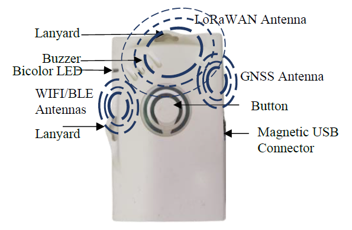

# Smart badge device

## Getting started

 The smart badge is shipped to the customer in "shipping" state to preserve battery lifetime. It can be brought back into "JOIN" state with a long button press. The tracker will then start the JOIN procedure which can be seen in LoRaWAN Network Server logs.

 After the LoRaWAN join is successful, it starts in motion tracking mode in the default configuration. For more details on the default configuration of the smart badge tracker see [here](/AbeewayRefGuide/default-config-delivered-ms/).

Refer to the [Startup process](/AbeewayRefGuide/functioning/startup-process/) topic for more details on the startup behaviour of the tracker

## Tracker best placement

 The device can be attached with the provided lanyard or placed in a bag, or inside an asset. It is recommended to place the tracker in a way that LoRaWAN/GNSS antennas are pointing towards the sky for best LoRaWAN/GNSS coverage.

:::danger Warning
- The tracker should not be submerged in water or left in the presence of high-pressure water jets for prolonged duration as the water will get inside the casing eventually and damage the tracker. Incorrect placement of the tracker will void the guarantee.
- The tracker should not be left with low battery/completely discharged for more than a month. We recommend to periodically charge the tracker at least once a month. The warranty is void if the battery of the tracker is not functional as it was not charged for prolonged period.
- The close environment and orientation of the tracker can influence the radio performance. For optimum results, keep the zone around the antenna area clear from any conducting material, magnetic fields and skin/body parts.  
:::