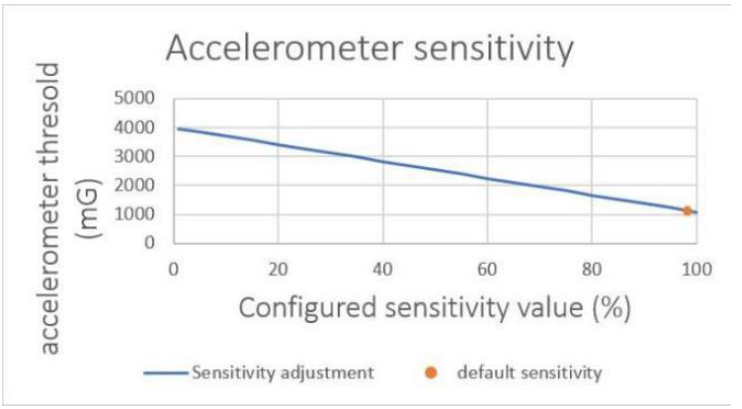

# Motion detection

 This feature is supported by all Abeeway trackers.

## Overview

The tracker embeds a three axes accelerometer, which detects accelerations and triggers motion events. It is configurable with three parameters:

-   *motion_sensitivity*: Allow a fine tuning of the acceleration intensity to trigger a motion event.
-   *motion_debounce*: Minimum duration of a movement to be detected (applicable if motion_sensitivity parameter is set to a value between 1 and 99).
-   *motion_duration*: Define the delay needed without any motion detection to generate a motion end event.

 The accelerometer is always active except in OFF mode.

## Motion sensitivity

The accelerometer sensitivity can be fine-tuned by configuration via the parameter *motion_sensitivity*. Prior to this version, this parameter expressed the accelerometer sensitivity in percentage. From the AT2 v2.3, this parameter accepts different value ranges selecting different modes:

-   1-30: **high sensitivity/low power**
-   100: **Default mode** (same behavior as the default value --0- in the previous versions).
-   101..200: **Low sensitivity** (sensitivity ranging from 1% to 100% as before).

The new *motion_debounce* parameter is used to define a motion minimum duration in the **high sensitivity/low power** mode.

### High sensitivity/low power mode

The configuration parameters used for this mode are:
-   The **measurement range** is +/- 4g
-   The **debounce** value is configured via the parameter *motion_debounce*
-   The detection **threshold** is configured via the *motion_sensitivity* parameter,and follows the formula:
    *motion_sensitivity* \* 0.063g
A movement will be detected if its intensity is above or equals to the *motion_sensitivity* value during at least the *motion_debounce* time. This time is calculated from the following formulas:
-   For an initial movement, the duration is given by the formula: *motion_debounce* \* 160 milliseconds
-   For a continuous motion, the duration is given by the formula: *motion_debounce* \* 80 milliseconds

:::tip Note
A *motion_sensitivity* value between 31 and 99 is capped to 30.
:::

### Default mode

Accelerometer configuration:

-   The **measurement range** is +/- 2g. All values above or below this range are capped.
-   The **debounce** value is fixed to 80ms
-   The **threshold** is fixed to 1.126g.
-   The accelerometer is in low power mode/low sensitivity.

Default configuration is obtained when Motion Sensitivity parameter is set to 100.

### Low sensitivity mode

 The configuration used for this mode is:

-   The **measurement range** is +/- 4g
-   The **debounce** value is fixed to 80ms
-   The **threshold** is configured via the *motion_sensitivity* parameter. The value in mg is 1080+29.2*(200-*motion_sensitivity*)

:::tip Note
The following picture shows the conversion between mg (milli Gravity unit) and percentage (low sensitivity mode):

 
 :::

## Motion duration

 The end of a motion is detected by the absence of movement during a
 delay configured via the parameter *motion_duration*.

 This parameter is expressed in seconds and ranges from \[60 .. 3600\].
 The factory default value is 120 seconds.

## Device orientation

The acceleration values from the three axes are available within the **motion end** event messages or by sending a specific downlink (Refer to [Request device configuration](/downlink-messages/request-device-configuration/readme.md) for more details). This allows the application to determine the tracker orientation.